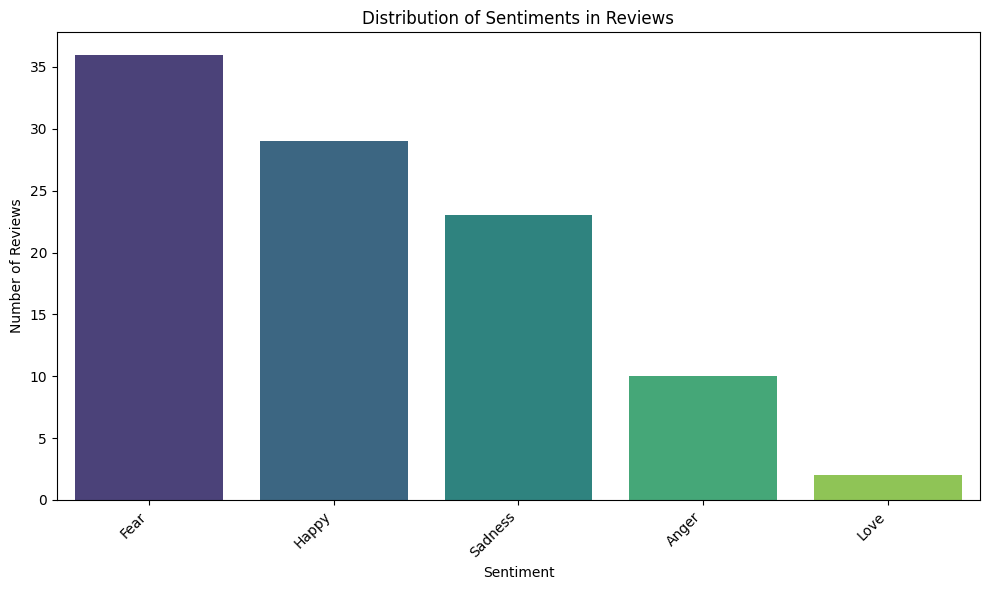

# UTS Big Data - Rama Ilham

## 👤 Penulis
* **Rama Ilham Ramadhan**
* **14022300024**
* **6B-BIS**
Mahasiswa Sistem Informasi
Universitas Bina Bangsa (UNIBA)

Repo ini berisi tugas Ujian Tengah Semester (UTS) untuk mata kuliah **Big Data**. Projek ini mencakup implementasi analisis data atau pengolahan dataset menggunakan teknologi Big Data.

## 📋 Deskripsi Projek
Projek ini bertujuan untuk mendemonstrasikan pemahaman mengenai konsep Big Data, pembersihan data (data cleaning), serta visualisasi atau pemodelan data sesuai dengan instruksi tugas UTS.

## 🛠️ Teknologi yang Digunakan
* **Python**: Bahasa pemrograman utama.
* **Jupyter Notebook**: Untuk eksplorasi dan dokumentasi langkah-langkah analisis.
* **Pandas / PySpark**: Untuk manipulasi data skala besar.
* **Matplotlib / Seaborn**: Untuk visualisasi data.

## 🚀 Cara Menjalankan
1.  Clone repository ini:
    ```bash
    git clone https://github.com/ramailh02/UTS_BIG-DATA_RAMA-ILHAM.git
    ```
2.  Masuk ke direktori projek:
    ```bash
    cd UTS_BIG-DATA_RAMA-ILHAM
    ```
3.  Instal library yang diperlukan (jika ada requirements.txt):
    ```bash
    pip install -r requirements.txt
    ```
4.  Buka file `.ipynb` menggunakan Jupyter Notebook atau VS Code.

## 📊 Struktur Folder
* `data/`: Berisi dataset yang digunakan (jika disertakan).
* `notebooks/`: File Jupyter Notebook utama.
* `README.md`: Dokumentasi projek.

## Visualisai Analisis Sentimen

